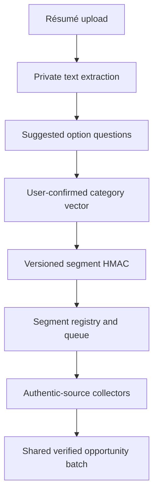

# Growth Profile Segments

## Goal

Create reusable, privacy-conscious opportunity segments from résumé-informed questions. People who confirm the same category vector receive the same segment identifier and can reuse one verified opportunity batch.

## Category vector

The hash input contains only normalized option identifiers:

- role family and career-stage bucket;
- experience domains;
- growth goals;
- requested opportunity types;
- broad participation geography;
- weekly commitment bucket;
- applicant context such as individual, academic institution, nonprofit, company, or team.

Names, email addresses, employers, résumé text, filenames, exact locations, exact years of experience, protected characteristics, and immigration status must not enter the category vector.

The browser prototype uses `SHA-256(version + canonical JSON)` so identical confirmed vectors produce identical hashes. Production should issue a versioned server-side `HMAC-SHA-256` identifier so internal taxonomy details cannot be enumerated from public identifiers.

## Production API

| Endpoint | Purpose |
|---|---|
| `POST /v1/profile-sessions` | Create a short-lived extraction session and signed upload URL. |
| `POST /v1/profile-sessions/{id}/answers` | Confirm option answers, discard extracted text, and return the segment ID. |
| `GET /v1/segments/{segment}/opportunities` | Return the current verified batch with source, retrieval time, deadline, and match reasons. |
| `POST /v1/segments/{segment}/refresh` | Idempotently enqueue an expired or missing segment batch. |
| `DELETE /v1/profile-sessions/{id}` | Delete uploaded and extracted résumé material immediately. |

## Batch behavior

1. A confirmed segment is registered with a taxonomy version, non-sensitive category vector, and anonymous demand count.
2. A queue deduplicates work by segment ID.
3. The next scheduled collector searches only approved authentic sources.
4. Normalization, deduplication, expiration, and source validation run before matching.
5. Results are stored once at `segments/{segment}/{batchVersion}` and reused by everyone in that segment.
6. A new user with the same segment receives the current batch immediately; stale batches are returned with a visible freshness warning while refresh runs.

## Privacy and safety controls

- Extract in a protected, short-lived session; delete the raw file and text after confirmation.
- Encrypt uploads and extracted text with per-session keys and enforce automatic expiry.
- Never use protected characteristics to rank or exclude opportunities.
- Treat the segment as pseudonymous data even though it excludes direct identifiers.
- Do not claim eligibility from similarity. Always link to official requirements.
- Keep source allowlists, provenance, retrieval timestamps, and audit logs.
- Rate-limit uploads, scan files, restrict types and sizes, and isolate document parsing.
- Provide consent, access, correction, export, and deletion controls before public launch.
